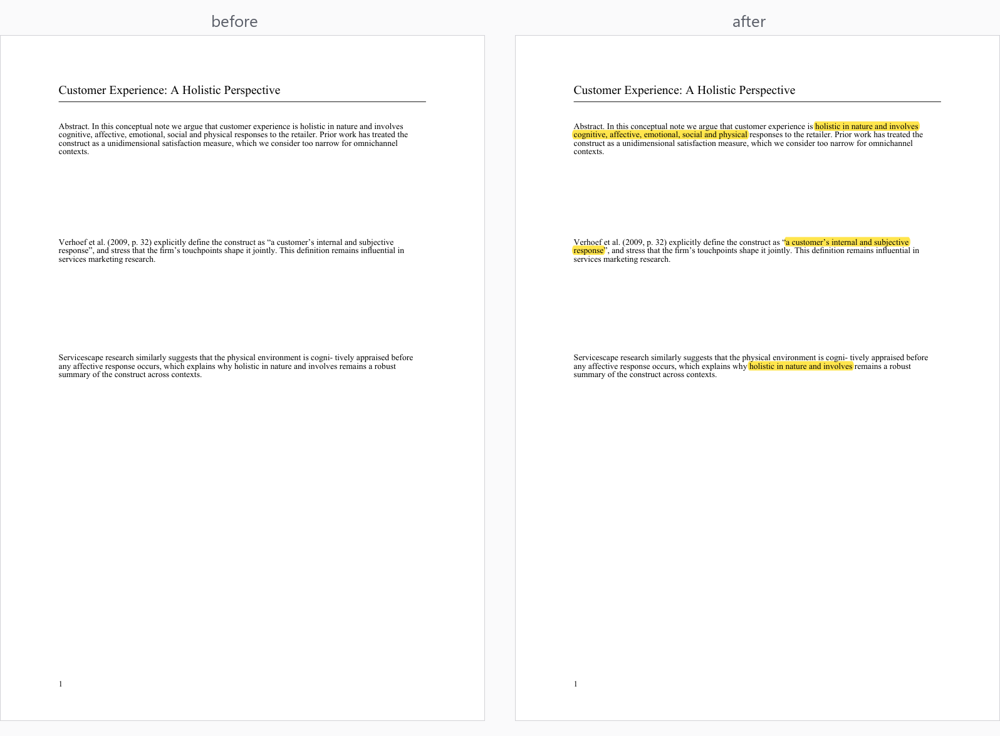

# paper-citation-tracer

**给论文写作用的引文溯源工具：给一段引文，自动在 PDF 原文里定位对应句子并标黄——核验"这句引文到底出不出自这篇文献"。**
Trace any quote back to its exact source in the PDF — and highlight it.




## 为什么需要它 / Why

当我们在借助 agent/AI 辅助写论文，找引用文献时，往往很难确定引用的文献是否合理，
引用的位置是否合理，甚至产生错误引用的情况，人工核验引用的合理性耗时长，非常消耗精力
为解决此问题，故而设计了paper-citation-tracer

## 经典用法 / Classic Workflow

1. **一段带引用的论文正文**——你刚让 AI 写完或润色的部分，中英文都行；
2. **对应的参考文献 PDF**——被引文献的原文文件；
3. 调用本 skill——它从引文中提取要害短语，在 PDF 全文中定位对应段落并标黄。

本skill将在各方面严肃核查引用的合理性与准确性，给出判断，供你抉择

---

## 安装 / Install

```bash
pip install pymupdf
```

## 命令行使用 / CLI Quick Start

```bash
# 基本用法：可重复 -q 传入关键短语
python highlight_citations.py paper.pdf \
    -q "holistic in nature and involves" \
    -q "cognitive, affective, emotional, social and physical"

# 限定页码范围、限制每个短语最多标注次数、保存后验证
python highlight_citations.py paper.pdf \
    -q "a customer's internal and subjective response" \
    --pages 1-8 --max-n 2 --verify

# 只看会命中哪里，不写文件（dry run）
python highlight_citations.py paper.pdf --quotes-file quotes.txt --dry-run
```

| 参数 | 默认 | 说明 |
|---|---|---|
| `-q / --quote` | — | 关键短语，可重复；建议 8–25 字符的独特短语 |
| `--quotes-file` | — | 每行一个短语的文本文件（`#` 开头为注释） |
| `-o / --output` | `*_highlighted.pdf` | 输出路径（**永远不会覆盖原 PDF**） |
| `--pages` | `all` | 页码范围，如 `1-8`、`3-`、`-5` |
| `--max-n` | `3` | 每个短语最多标注次数（防止整页变黄） |
| `--color` | `yellow` | `yellow/green/blue/red` 或 `r,g,b`（0–1） |
| `--keep-references` | 关 | 默认扫到 References/Bibliography 就停 |
| `--dry-run` | 关 | 只报告命中位置，不写文件 |
| `--verify` | 关 | 保存后把每处高亮下的文本打印出来，人工核对 |


## 作为 Agent Skill 使用 / Use as an Agent Skill

仓库根目录的 [`SKILL.md`](SKILL.md) 是一份完整的 agent skill（WorkBuddy /
Claude Code 等 agent-skill 格式）：把整个文件夹放进你的 skills 目录，agent
就能在你写综述时自动完成"读引文 → 选关键词 → 标注 → 验证"的全流程，
包括"第一篇引文对不上经典出处"这类需要判断力的场景。

在 **WorkBuddy** 中：`安装技能 → 从文件夹导入`，或直接把本目录复制到
`~/.workbuddy/skills/`。

## 目录结构 / Repository Layout

```
paper-citation-tracer/
├── SKILL.md                  # agent skill 定义（工作流 + 已知陷阱，核心文档）
├── highlight_citations.py    # 独立 CLI（无 agent 环境也能用）
├── requirements.txt
├── LICENSE                   # MIT
└── examples/
    ├── make_demo.py          # 生成含三大陷阱的示例 PDF
    ├── make_preview.py       # 生成 README 对比图
    ├── sample_paper.pdf      # 示例输入
    └── sample_paper_highlighted.pdf  # 示例输出
```


## 已知陷阱 / Known Pitfalls

完整的实战经验清单（扫描版 OCR 文档、`max_n` 失控、xref 警告、"第一篇引文
对不上出处"）见 [SKILL.md 的「已知陷阱」章节](SKILL.md#已知陷阱)。

## License

[MIT](LICENSE)
